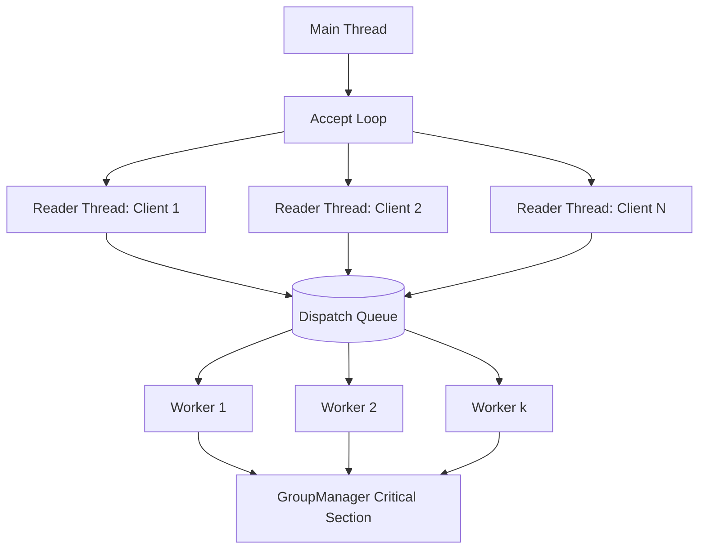
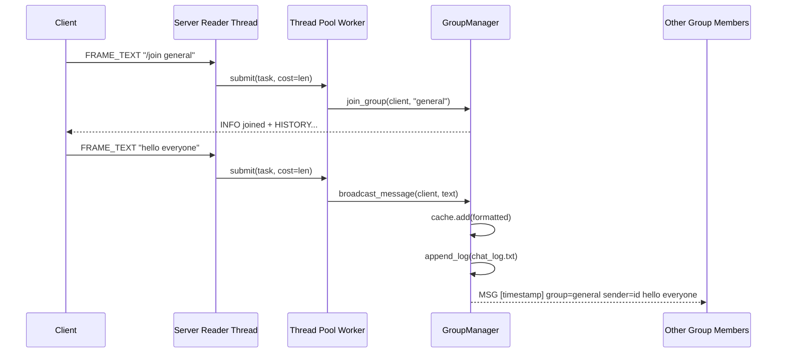

# GroupChat Design Document

This document is the formal design write-up for the GroupChat operating systems project.
It covers the required architecture, protocol, cache, scheduling, and optional feature plans.

## 1) Architecture Overview

### 1.1 System Summary

GroupChat uses a client-server model over TCP.
Multiple clients connect to one central server. The server owns group membership state, routes chat/media traffic, and enforces scheduling decisions for text-message processing.

Core responsibilities:

- Client: user command parsing, local media file I/O, frame send/receive, playback.
- Server accept loop: accepts sockets and creates one reader thread per client.
- Server thread pool: executes queued text tasks using RR (FIFO) or SJF.
- Group manager: tracks group membership, caches recent messages, handles synchronization.
- Shared protocol layer: frame parsing/encoding and constants.

### 1.2 Client-Server Design Diagram

```mermaid
flowchart LR
  C1[Client A]\n/chat /audio /video --> S[GroupChat Server]
  C2[Client B]\n/chat /audio /video --> S
  C3[Client C]\n/chat /audio /video --> S

  S --> GM[Group Manager\nMembership + History Cache]
  S --> TP[Thread Pool\nRR or SJF]
  GM --> LOG[(chat_log.txt)]
  S --> C1
  S --> C2
  S --> C3
```

### 1.3 Server Thread Model (Including Thread Pool)

The server has two levels of concurrency:

- Level 1 (I/O reader threads): one thread per connected client reads incoming frames.
- Level 2 (worker pool): a fixed-size worker pool executes text-message tasks from a shared dispatch queue.

Design intent:

- I/O remains responsive for many clients.
- CPU-style task scheduling policy can be demonstrated and measured independently (RR/SJF).
- Shared mutable state is isolated in GroupManager and guarded by a mutex.



### 1.4 Group and Message Flow Diagram

Example: client joins group and sends one text message.



## 2) Message Protocol Design

### 2.1 Existing Transport Frame

The current implementation uses a compact transport frame:

- 1 byte: frame type
- 4 bytes: payload size
- N bytes: payload bytes

This supports both text and binary media chunks.

### 2.2 Assignment Packet Format (Required Fields)

To satisfy the required packet design fields (`type`, `group ID`, `timestamp`, `payload size`, `payload`), the project defines the following logical packet header for chat/media messages:

```c
// Network byte order (big-endian)
struct MessagePacketHeader {
  uint8_t  type;         // chat, join, leave, audio chunk, video chunk, etc.
  uint32_t group_id;     // numeric group identifier
  uint64_t timestamp_ms; // Unix epoch time in milliseconds
  uint32_t payload_size; // number of bytes following header
};
// uint8_t payload[payload_size];
```

Field semantics:

- `type`: protocol operation code.
- `group_id`: routes message to exactly one logical group.
- `timestamp_ms`: server or sender time metadata used for ordering/logging.
- `payload_size`: bounds checking and allocation safety.
- `payload`: UTF-8 text bytes or raw binary media bytes.

### 2.3 Type Values (Example Mapping)

- `0x01`: text chat
- `0x02`: join group
- `0x03`: leave group
- `0x04`: audio begin
- `0x05`: audio chunk
- `0x06`: audio end
- `0x07`: video begin
- `0x08`: video chunk
- `0x09`: video end
- `0x0A`: server info/error

### 2.4 Validation and Robustness Rules

- Reject packets where `payload_size > MAX_FRAME_SIZE`.
- Sanitize filenames before media forwarding.
- Reject text/media attempts if sender is not in a group.
- Treat unknown `type` values as protocol errors.

## 3) Cache Design

### 3.1 Cache Size and Eviction Policy

Each chat group owns a fixed-size message cache of 20 entries.

- Capacity: 20 messages per group.
- Effective policy in implementation: circular/FIFO eviction (oldest dropped first).
- Data structure: deque-like container for O(1) append and pop-front.

Note on terminology: assignment allows LRU or Circular. This implementation uses Circular FIFO, which is simpler and deterministic for recent-history replay.

### 3.2 Storage and Retrieval

Storage path:

1. Worker formats outgoing message with timestamp, group, sender.
2. Group cache appends formatted string.
3. If full, oldest entry is evicted.
4. Message is also appended to persistent log file.

Retrieval path:

1. Client joins a group.
2. Server loads that group's in-memory history snapshot.
3. Server sends `HISTORY` lines to the joining client in chronological order.

### 3.3 Synchronization Approach

Group data is shared mutable state, protected by one mutex in `GroupManager`.

Critical sections cover:

- `groups_` membership and per-group cache updates.
- `client_group_` membership map.
- `client_ids_` sender identity map.

Thread pool synchronization:

- Internal queue lock for enqueue/dequeue operations.
- `condition_variable` used to sleep idle workers and wake them on submit.

Concurrency safety goal:

- No concurrent unsynchronized writes to membership/cache structures.
- No busy-waiting in worker threads.

## 4) Scheduling Design

### 4.1 Strategy

The server supports two dispatch strategies for text tasks:

- RR (Round Robin / FIFO queue): first submitted, first executed.
- SJF (Shortest Job First): smallest `cost` first, where cost is message length in bytes.

Why this is educational:

- RR demonstrates fairness and predictable order.
- SJF demonstrates throughput optimization for short jobs.
- Both are implemented at application level on top of OS thread scheduling.

### 4.2 Task Dispatch Queue Diagram

```mermaid
flowchart LR
  IN[Reader Threads submit task(cost)] --> SEL{Mode}
  SEL -->|RR| RRQ[(FIFO Queue)]
  SEL -->|SJF| SJQ[(Priority Queue\nmin cost, then sequence)]
  RRQ --> W[Worker Threads]
  SJQ --> W
  W --> EXEC[Execute task: parse command or broadcast]
```

### 4.3 Dispatch Rules

- Every text line becomes one task with `cost = line.length`.
- SJF tie-breaker uses monotonically increasing sequence number to preserve stable ordering among equal-cost tasks.
- Media frames are relayed immediately by reader threads and are not pooled as text tasks.

## 5) Extra Features Plan (Optional)

### 5.1 Audio/Video Simulation Plan

Current status:

- Supports `/audio <path>` and `/video <path>` commands.
- Uses begin/chunk/end framing for streaming-like transfer.
- Clients can play last or specified file with `/play [path]`.

Planned enhancement:

- Add progress feedback per transfer (percent + bytes).
- Add configurable chunk sizes based on runtime bandwidth.
- Add transfer interruption/retry support.

### 5.2 Client Verification Logic Plan

Current baseline checks:

- Must join a group before sending media.
- Server rejects unknown/invalid commands in chat path.
- Filenames are sanitized before use.

Planned verification improvements:

- Add client handshake with protocol version.
- Enforce maximum command length and UTF-8 validity for text payloads.
- Add per-client rate limiting for spam/flood protection.

### 5.3 Security/Permissions Plan

Current state:

- Basic input sanitation and bounded frame sizes.
- Group membership constrains media/message fan-out.

Planned security extensions:

- Group access control lists (private/public groups).
- Role model (`owner`, `moderator`, `member`) with command permissions.
- Optional authentication token at connection setup.
- Structured audit log for joins/leaves/admin actions.

## 6) Summary

This design provides a complete OS-focused chat architecture with:

- Real concurrency (client reader threads + worker thread pool).
- Explicit scheduling policy control (RR and SJF).
- Bounded in-memory cache with deterministic eviction.
- A binary packet header design covering all required fields.
- Optional extension path for media quality, verification, and security.

The document can be submitted directly as the project design report.
